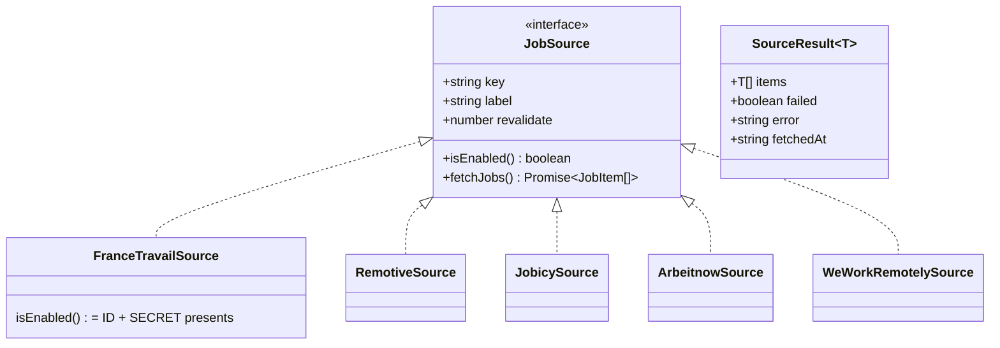
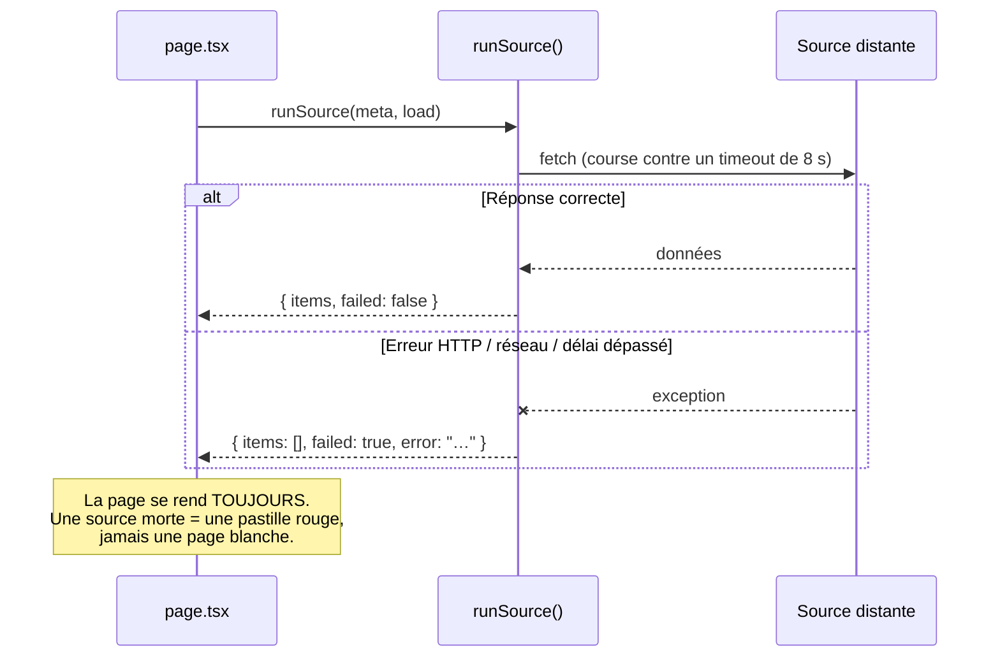

# Architecture — Veille

## Vue d'ensemble

Un seul flux : la page serveur demande le tableau de bord, celui-ci lance toutes les sources **en
parallèle** derrière une enveloppe de résilience, normalise, puis l'UI compose. Aucune base de
données : le cache ISR de Next tient lieu de stockage.

```mermaid
flowchart TD
    U([Navigateur]) -->|GET /| P["page.tsx<br/>Server Component<br/>revalidate = 600 s"]

    P --> D["getDashboard()<br/>Promise.all — tout en parallèle"]

    D --> RS{{"runSource()<br/>try/catch + timeout 8 s<br/>ne rejette JAMAIS"}}

    RS --> T[Sources tech]
    RS --> W[Sources monde]
    RS --> J[Sources emploi]

    T --> HN[Hacker News API]
    T --> DV[dev.to API]
    T --> GT[GitHub Search API]
    T --> GB[GitHub Blog RSS]
    T --> AR[Ars Technica RSS]

    W --> LM[Le Monde RSS]

    J --> FT["France Travail<br/>isEnabled() = false<br/>en attente de clé"]
    J --> RM[Remotive API]
    J --> JY[Jobicy API]
    J --> AN[Arbeitnow API]
    J --> WWR[We Work Remotely RSS]

    T --> M["mergeFeeds()<br/>dédup URL + tri chrono"]
    W --> M
    J --> RK["rankJobs()<br/>filtre tech + score pertinence"]

    M --> UI["FeedList / JobList / SourceStatus"]
    RK --> UI
    UI --> U

    style FT stroke-dasharray: 5 5
    style RS fill:#1d2433,stroke:#5b9cff
```

## Le contrat commun

Toute source, quelle que soit la forme de son API, est normalisée **dans son adaptateur** vers
`FeedItem` ou `JobItem`. L'UI ne voit jamais la forme brute d'une API tierce.

Ajouter une source d'emploi = écrire une classe qui implémente `JobSource`, plus **une ligne** dans
le registre `JOB_SOURCES`. Rien d'autre ne bouge.

## Résilience — la règle non négociable

Aucune source ne peut faire tomber la page. `runSource()` est le seul point de passage :

## Fraîcheur

Deux niveaux d'ISR, cohérents entre eux :

- **Route** — `export const revalidate = 600` : la page est régénérée en arrière-plan au plus
  toutes les 10 min (stale-while-revalidate). Le visiteur ne subit jamais l'attente des 10 API.
- **Par requête** — chaque `fetch` porte son `next: { revalidate, tags }` : 600 s pour l'actu qui
  bouge vite (HN, dev.to, Le Monde), 900 s pour les flux plus lents (blogs, emploi). Next retient
  la valeur la plus basse pour la route, soit 600 s.

Chaque section affiche son propre horodatage, calculé sur le `fetchedAt` des sources qui ont
réellement répondu (`sectionFetchedAt`). Si toutes échouent, on affiche l'état dégradé plutôt qu'un
horodatage qui mentirait sur la fraîcheur.

## Ce qui est testé, et pourquoi ça

Les tests couvrent la **logique pure** — parsing et normalisation — pas le réseau. Mocker
l'intégralité d'une API tierce ne teste que la fidélité du mock ; les fixtures utilisées ici sont
des **extraits fidèles des vrais flux**, capturés avant d'écrire le code.

| Fichier | Ce qui est verrouillé |
| --- | --- |
| `rss.test.ts` | entités HTML, CDATA, `dc:creator` multi-ligne, repli sur `guid` (Le Monde), format Atom, XML malformé |
| `relevance.test.ts` | filtre tech (c'est lui qui a disqualifié RemoteOK), scoring géo/junior/stack, déduplication |
| `runSource.test.ts` | une source qui jette n'en fait pas tomber d'autres ; le timeout coupe |
| `franceTravail.test.ts` | l'interrupteur `isEnabled`, la normalisation, **et le fait que le secret ne parte jamais en query string** |
| `weWorkRemotely.test.ts` | découpage « Entreprise: Poste », balise maison `<region>` |
| `merge.test.ts` | tri chronologique, items sans date conservés en fin, dédup d'URL, sources mortes ignorées |
